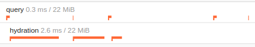

# Teaching Doctrine to be Lazy

<!--
_footer: 'Image Credit: Sébastien Lavalaye'
_class: lead
-->


_by Kevin Bond_


# Me?


- From Ontario, Canada :canada:
- Husband, father of three
- Symfony user since `1.0`
- Symfony Core Team
- Obsessed with clean, beautiful APIs
- `@kbond` on GitHub/Slack
- `@zenstruck` on Twitter

# zenstruck?

* A GitHub organization where my open source packages live
  - `zenstruck/foundry`
  - `zenstruck/browser`
  - `zenstruck/messenger-test`
  - `zenstruck/filesystem` :eyes: _(wip)_
  - `zenstruck/schedule-bundle` _(for <6.3)_
  - _..._
* Many now co-maintained by Nicolas PHILIPPE (`@nikophil`)

# What we'll cover

<!--
header: Teaching Doctrine to be Lazy
footer: 'Kevin Bond &#x2022; _@zenstruck_ &#x2022; _github.com/kbond_'
paginate: true
-->

* Hydration considerations
* Lazy batch iterating (readonly)
* Lazy batch processing
  - Updating/Deleting/Persisting
* Lazy relationships
* Future ideas

# Sample App

```
                    +----------+       +------------+
                    | PRODUCT  |       | PURCHASE   |
                    |----------|       |------------|
                    | id       |---+   | id         |
                    | sku      |   +--<| product_id |
                    | stock    |       | date       |
                    | category |       | amount     |
                    +----------+       +------------+
```
- 1,000+ products, 100,000+ purchases
- Products may have 1,000's of purchases

# Mongo?

* With some tweaks, the demonstrated techniques should/could apply to any `doctrine/persistence` implementation
* I'm using `doctrine/orm` for the examples in this talk

# Part 1: Hydration Considerations

* Hydration is expensive
* Some _rules_
  * _Only hydrate what you need_ :white_check_mark:
  * _Only hydrate when you need it_ :white_check_mark:
  * _Cleanup after yourself_ :white_check_mark:

## Profiling Hydrations

<!--
header: Teaching Doctrine to be Lazy - Part 1: Hydration Considerations
-->

* Web Profiler?
  * 
  * [`debesha/doctrine-hydration-profiler-bundle`](https://github.com/debesha/DoctrineProfileExtraBundle)
  * DoctrineBundle?
    * Needs a hook in [`doctrine/orm`](https://github.com/doctrine/orm/pull/9545)
    * 
* Blackfire.io `metrics.doctrine.entities.hydrated`

# Part 2: Batch Iterating

<!--
header: Teaching Doctrine to be Lazy
-->

* _Read-only_
* Use SQL?
* `purchase:report` command
  - Generates a report for all purchases

## `$repo->findAll()`

<!--
header: Teaching Doctrine to be Lazy - Part 2: Batch Iterating
-->

```
 100000/100000 [▓▓▓▓▓▓▓▓▓▓▓▓▓▓▓▓▓▓▓▓▓▓▓▓▓▓▓▓] 100%  1 sec/1 sec  166.0 MiB

 // Time: 2 secs, Queries: 1
```

* _Only hydrate what you need_ :white_check_mark:
* _Only hydrate when you need it_ :x:
* _Cleanup after yourself_ :x:

## `$repo->matching(new Criteria())`

```
  100000/100000 [▓▓▓▓▓▓▓▓▓▓▓▓▓▓▓▓▓▓▓▓▓▓▓▓▓▓▓▓] 100%  1 sec/1 sec  168.0 MiB

 // Time: 1 sec, Queries: 2
```

* _Only hydrate what you need_ :white_check_mark:
* _Only hydrate when you need it_ :x:
* _Cleanup after yourself_ :x:

## `Doctrine\ORM\Query::toIterable()`

```
 100000 [▓▓▓▓▓▓▓▓▓▓▓▓▓▓▓▓▓▓▓▓▓▓▓▓▓▓▓▓] 2 secs 166.0 MiB

 // Time: 2 secs, Queries: 1
```

* _Only hydrate what you need_ :white_check_mark:
* _Only hydrate when you need it_ :white_check_mark:
* _Cleanup after yourself_ :x:

## `Doctrine\ORM\Tools\Pagination\Paginator`

```
 100000/100000 [▓▓▓▓▓▓▓▓▓▓▓▓▓▓▓▓▓▓▓▓▓▓▓▓▓▓▓▓] 100%  1 sec/1 sec  168.0 MiB

 // Time: 1 sec, Queries: 2
```

* _Only hydrate what you need_ :white_check_mark:
* _Only hydrate when you need it_ :white_check_mark:
* _Cleanup after yourself_ :x:

## Batch Utilities - Iterator

* [`ocramius/doctrine-batch-utils`](https://github.com/Ocramius/DoctrineBatchUtils)
  * Takes an ORM Query object and iterates over the result set in batches
  * _Clear_ the `ObjectManager` after each _batch_ to free memory
* Enhanced:
  * Accepts _any_ `iterable` and _any_ `ObjectManager` instance

## `BatchIterator`

```php
final public function getIterator(): \Traversable
{
    $iteration = 0;
    foreach ($this->items as $key => $value) {
        yield $key => $value;

        if (++$iteration % $this->batchSize) {
            continue;
        }
        $this->em->clear();
    }
    $this->em->clear();
}
```

## Use `BatchIterator`

```php
$iterator = new BatchIterator($query->toIterable(), $this->em);
```

```
 100000 [▓▓▓▓▓▓▓▓▓▓▓▓▓▓▓▓▓▓▓▓▓▓▓▓▓▓▓▓] 100% 2 secs 20.0 MiB

 // Time: 2 secs, Queries: 1
```

* _Only hydrate what you need_ :white_check_mark:
* _Only hydrate when you need it_ :white_check_mark:
* _Cleanup after yourself_ :white_check_mark:

## Memory Stays Constant, Time Increases

200,000 purchases?

```
 200000 [▓▓▓▓▓▓▓▓▓▓▓▓▓▓▓▓▓▓▓▓▓▓▓▓▓▓▓▓] 100% 4 secs 20.0 MiB

 // Time: 4 secs, Queries: 1
```

1,000,000 purchases?

```
 1000000 [▓▓▓▓▓▓▓▓▓▓▓▓▓▓▓▓▓▓▓▓▓▓▓▓▓▓▓▓] 19 secs 22.0 MiB

 // Time: 19 secs, Queries: 1
```

## 1,000,000 Purchases Using `$repo->findAll()`?

```
 1000000/1000000 [▓▓▓▓▓▓▓▓▓▓▓▓▓▓▓▓▓▓▓▓▓▓▓▓▓▓▓▓] 100% 2 secs/2 secs 1.5 GiB

 // Time: 16 secs, Queries: 1
```

1.5 GiB of memory? :scream:

# Part 3: Batch Processing

<!--
header: Teaching Doctrine to be Lazy
-->

## Batch Updating

<!--
header: Teaching Doctrine to be Lazy - Part 3: Batch Processing (Update)
-->

* `product:stock-update` Command
  * Loop through all products
  * Update stock level from a source (ie. CSV files, API, etc)

## `$repo->findAll()`

```php
foreach ($repo->findAll() as $product) {
    /** @var Product $product */
    $product->setStock($this->currentStockFor($product));
    $this->em->flush();
}
```

## `$repo->findAll()`

```php
foreach ($repo->findAll() as $product) {
    /** @var Product $product */
    $product->setStock($this->currentStockFor($product));
    $this->em->flush();
}
```

```
 1000/1000 [▓▓▓▓▓▓▓▓▓▓▓▓▓▓▓▓▓▓▓▓▓▓▓▓▓▓▓▓] 100% 8 secs/8 secs 16.0 MiB

 // Time: 8 secs, Queries: 988
```

## `$repo->findAll()`, Delay _Flush_

```php
foreach ($repo->findAll() as $product) {
    /** @var Product $product */
    $product->setStock($this->currentStockFor($product));
}
$this->em->flush();
```

## `$repo->findAll()`, Delay _Flush_

```php
foreach ($repo->findAll() as $product) {
    /** @var Product $product */
    $product->setStock($this->currentStockFor($product));
}
$this->em->flush();
```

```
 1000/1000 [▓▓▓▓▓▓▓▓▓▓▓▓▓▓▓▓▓▓▓▓▓▓▓▓▓▓▓▓] 100% < 1 sec/< 1 sec 16.0 MiB

 // Time: < 1 sec, Queries: 2
```

## `$repo->findAll()`, Delay _Flush_

100,000 products?

```
 100000/100000 [▓▓▓▓▓▓▓▓▓▓▓▓▓▓▓▓▓▓▓▓▓▓▓▓▓▓▓▓] 100% < 1 sec/< 1 sec 186.0 MiB

 // Time: 12 secs, Queries: 2
```

## Batch Utilities - Processor

* [`ocramius/doctrine-batch-utils`](https://github.com/Ocramius/DoctrineBatchUtils)
    * Takes an ORM Query object and iterates over the result set in batches
    * _Flush_ **and** _clear_ the `ObjectManager` after each _batch_ to free memory and save changes
    * Wrap everything in a transaction
* Enhanced:
    * Accepts _any_ `iterable` and _any_ `ObjectManager` instance

## Using `BatchProcessor`

```php
$processor = new BatchProcessor($query->toIterable(), $this->em);

foreach ($processor as $product) {
    /** @var Product $product */
    $product->setStock($this->currentStockFor($product));
}
// no need for "flush"
```

```
 1000 [▓▓▓▓▓▓▓▓▓▓▓▓▓▓▓▓▓▓▓▓▓▓▓▓▓▓▓▓] < 1 sec 16.0 MiB

 // Time: < 1 sec, Queries: 1
```

## Using `BatchProcessor` - 100,000 Products

```
 100000 [▓▓▓▓▓▓▓▓▓▓▓▓▓▓▓▓▓▓▓▓▓▓▓▓▓▓▓▓] 11 secs 22.0 MiB

 // Time: 11 secs, Queries: 2
```

## Batch Deleting

<!--
header: Teaching Doctrine to be Lazy - Part 3: Batch Processing (Delete)
-->

* DQL `DELETE` statement?
* `PreRemove`/`PostRemove` events?
* `purchase:purge` Command
  * Delete all purchases older than X days
  * Imagine a `PostRemove` event that archives the purged purchases

## Using `BatchProcessor`

```php
$processor = new BatchProcessor($query->toIterable(), $this->em);

foreach ($processor as $purchase) {
    /** @var Purchase $purchase */
    $this->em->remove($purchase); // no need for "flush"
}
```

## Using `BatchProcessor` - 100,000 Purchases

```
 75237 [▓▓▓▓▓▓▓▓▓▓▓▓▓▓▓▓▓▓▓▓▓▓▓▓▓▓▓▓] 100% 9 secs 18.0 MiB

 // Time: 9 secs, Queries: 1
```

## Using `BatchProcessor` - 1,000,000 Purchases

```
 753854 [▓▓▓▓▓▓▓▓▓▓▓▓▓▓▓▓▓▓▓▓▓▓▓▓▓▓▓▓] 100%  1 min  18.0 MiB

 // Time: 1 min, Queries: 1
```

## Batch Persisting

<!--
header: Teaching Doctrine to be Lazy - Part 3: Batch Processing (Persist)
-->

* `product:import` Command
  * Imports products from a _source_ (ie. CSV files, API, etc)
  * We'll use a `Generator` to _yield_ `Product` instances from our _source_
* :exclamation:_Requires_ enhanced `BatchProcessor`
  * Accepts _any_ iterable

## Using `BatchProcessor`

```php
$processor = new BatchProcessor(
    $this->products(), // Product[] - our "source"
    $this->em,
);

foreach ($processor as $product) {
    /** @var Product $product */
    $this->em->persist($product); // no need for "flush"
}
```

## Using `BatchProcessor` - Import 1,000

```
 1000 [▓▓▓▓▓▓▓▓▓▓▓▓▓▓▓▓▓▓▓▓▓▓▓▓▓▓▓▓] < 1 sec 16.0 MiB

 // Time: < 1 sec, Queries: 1
```

## Using `BatchProcessor` - Import 100,000

```
 100000 [▓▓▓▓▓▓▓▓▓▓▓▓▓▓▓▓▓▓▓▓▓▓▓▓▓▓▓▓] 12 secs 16.0 MiB

 // Time: 12 secs, Queries: 1
```

# Part 4: Lazy Relationships

<!--
header: Teaching Doctrine to be Lazy
-->

* `product:report` Command
  * Loop over all products (using our `BatchIterator`)
  * For each product
    * Fetch details on the most recent purchase
    * Fetch number of purchases in the last 30 days
  * Some products have 10,000+ purchases

## Command Code

<!--
header: Teaching Doctrine to be Lazy - Part 4: Lazy Relationships
-->

```php
foreach ($products as $product) {
    /** @var Product $product */
    /** @var Collection&Selectable $purchases */
    $purchases = $product->getPurchases();
    $last30Days = Criteria::create()->where(
        Criteria::expr()->gte('date', new \DateTimeImmutable('-30 days'))
    );

    $this->addToReport(
        $product->getSku(),
        $purchases->first() ?: null, // most recent purchase
        $purchases->matching($last30Days)->count(),
    );
}
```

## Standard One-to-Many Relationship

```php
#[ORM\Entity]
class Product
{
    #[ORM\OneToMany(mappedBy: 'product', targetEntity: Purchase::class)]
    #[ORM\OrderBy(['date' => 'DESC'])]
    private Collection $purchases;

    public function getPurchases(): Collection
    {
        return $this->purchases;
    }
}
```

## Standard One-to-Many Relationship

```php
$purchases = $product->getPurchases();

$purchases->count(); // initializes entire collection
$purchases->first(); // initializes entire collection
$purchases->slice(0, 10); // initializes entire collection

foreach ($purchases as $purchase) {
    // initializes entire collection
}
```

## Standard One-to-Many Relationship

```
 1000 [▓▓▓▓▓▓▓▓▓▓▓▓▓▓▓▓▓▓▓▓▓▓▓▓▓▓▓▓] 6 secs 128.0 MiB

 // Time: 6 secs, Queries: 1001
```

## _Extra Lazy_ One-to-Many Relationship

```php
#[ORM\Entity]
class Product
{
    #[ORM\OneToMany(
        mappedBy: 'product',
        targetEntity: Purchase::class,
        fetch: 'EXTRA_LAZY', // !!!
    )]
    #[ORM\OrderBy(['date' => 'DESC'])]
    private Collection $purchases;
}
```

## _Extra Lazy_ One-to-Many Relationship

Assuming the collection hasn't been _previously initialized_,
Certain methods create new queries:

```php
$purchases = $product->getPurchases();

$purchases->count(); // creates an additional "count" query
$purchases->first(); // initializes entire collection !!
$purchases->slice(0, 10); // creates an additional "slice" query

foreach ($purchases as $purchase) {
    // initializes entire collection
}
```

## _Extra Lazy_ One-to-Many Relationship

More efficient `first()`:

```php
$purchases = $product->getPurchases();

$purchases->slice(0, 1)[0] ?? null;
```

## Updated Command Code

```php
foreach ($products as $product) {
    // ...

    $this->addToReport(
        $product->getSku(),
        $purchases->slice(0, 1)[0] ?? null, // most recent purchase
        $purchases->matching($last30Days)->count(),
    );
}
```

## _Extra Lazy_ One-to-Many Relationship

```
 1000 [▓▓▓▓▓▓▓▓▓▓▓▓▓▓▓▓▓▓▓▓▓▓▓▓▓▓▓▓]  1 sec 18.0 MiB

 // Time: 1 sec, Queries: 2001
```

## n+x Problem?

* _...it depends..._
* fetch joins?
  * Can kill performance (I know from experience)
* Saving the number of queries _at all costs_ is not always the best solution
* If the collection has many items, hydration will be more
  expensive than the extra queries
* Evaluate your models

# Part 5: Future Ideas

<!--
header: Teaching Doctrine to be Lazy
-->

Exploring these in [`zenstruck/collection`](https://github.com/zenstruck/collection).

## Alternate _Lazy by Default_ `ObjectRepository`

<!--
header: Teaching Doctrine to be Lazy - Part 5: Future Ideas
-->

## `ObjectRepository` Interface

```php
/**
 * @template T of object
 * @extends \IteratorAggregate<T>
 */
interface ObjectRepository extends \IteratorAggregate, \Countable
{
    /**
     * @param mixed|Criteria $specification
     *
     * @return Result<T>
     */
    public function filter(mixed $specification): Result;
}
```

## ORM `ObjectRepository::filter()`

- `$specification` can be:
    - `array<string,mixed>`: works like `findBy()`
    - `Criteria`: works like `matching()`
    - `callable(QueryBuilder,string):void`: custom query

## Using the `$specification` callable

```php
$purchases = $repo->filter(
    function(QueryBuilder $qb, string $root) use ($newerThan) {
        $qb->where("{$root}.date > :newerThan")
            ->setParameter('newerThan', $newerThan)
        ;
    }
);
```

## Specification Objects

You _could_ extend this `ObjectRepository` to add your methods,
but, because `filter()` accepts `callable(QueryBuilder)`,
you can create invokable specification objects instead.

## `Between` Specification

```php
final class Between
{
    public function __invoke(QueryBuilder $qb, string $root): void
    {
        if ($this->from) {
            $qb->andWhere("{$root}.date >= :from")
                ->setParameter('from', $this->from)
            ;
        }

        // "to" logic...
    }
}
```

## Use `Between` Specification

```php
/** @var Result<Purchase> $purchases */
$purchases = $productsRepo->filter(
    new Between('2021-01-01', '2021-12-31')
);
```

## Inject as a Service

```php
public function someAction(ObjectRepositoryFactory $factory)
{
    /** @var ObjectRepository<Product> $repo */
    $repo = $factory->create(Product::class);

    $products = $repo->filter(['category' => 'books']);

    $products = $repo->filter(function(QueryBuilder $qb) {
        $qb->where('...');
    });
}
```

## Inject as a Service (Symfony 6.3+)

```php
/**
 * @param ObjectRepository<Product> $repo
 */
public function someAction(
    #[ForClass(Product::class)] // extends "Autowire"
    ObjectRepository $repo,
) {
    $products = $repo->filter(['category' => 'books']);

    $products = $repo->filter(function(QueryBuilder $qb) {
        $qb->where('...');
    });
}
```

## `Result` Interface

```php
/**
 * @template T of object
 * @extends \IteratorAggregate<T>
 */
interface Result extends \IteratorAggregate, \Countable
{
    public function first(): T|null;
    public function take(int $limit, int $offset = 0): self;
    public function process(int $chunkSize = 100): BatchProcessor
    public function toArray(): array;

    // ...
}
```

## Paginating the `Result`

```php
class ResultPagerfantaAdapter implements AdapterInterface
{
    public function getNbResults(): int
    {
        return $this->result->count();
    }

    public function getSlice(int $offset, int $length): array
    {
        return $this->result->take($length, $offset)->toArray();
    }
}
```

## _Lazier_ Doctrine Collection

```php
$purchase = $purchases->first(); // use slice(0, 1)[0] ?? null internally

foreach ($purchases as $purchase) {
    // lazily iterate "chunks" if large count
}
```

## Generic Specification System

```php
$specification = Spec::andX(
    new Between(from: new \DateTimeImmutable('-1 year')), // in last year
    Spec::greaterThan('amount', 100.00), // amount > $100.00
    Spec::sortDesc('date'), // sort by date
);
```

## Generic Specification System

Use the same _specification object_ in multiple places:

```php
// use with ORM
$purchases = $ormPurchaseRepository->filter($specification);

// use with Mongo
$purchases = $mongoPurchaseRepository->filter($specification);

// use with Collection
$purchases = $product->getPurchases()->filter($specification);
```

# Thank You!

<!--
header: Teaching Doctrine to be Lazy
-->

- `@kbond` on GitHub/Slack
- `@zenstruck` on Twitter
- Sample Code: [github.com/kbond/lazy-doctrine](https://github.com/kbond/lazy-doctrine)
- Slides: [speakerdeck.com/kbond](https://speakerdeck.com/kbond)
- [`zenstruck/collection`](https://github.com/zenstruck/collection)


